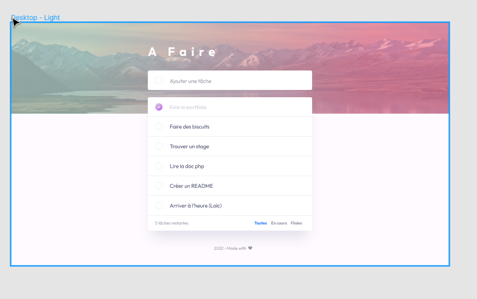

# Todo List
## Consigne :
Le HTML/CSS étant déjà fourni, vous devez réaliser les scripts js et php afin de
rendre le projet fonctionnel.

### Spécificités techniques :

* Les tâches ajoutées doivent êtres stockées en BDD
  * 3 vues possibles :
    * Toutes: affichera toutes les tâches ( celles en cours et celles terminées)
    * En cours : affichera toutes les tâches en cours
    * Terminées : afficher les tâches terminées
  * Le changement d’une vue à l’autre doit se faire en Ajax
  * Possibilité de réorganiser la liste des tâches à l’aide d’un drag and drop

### Langages :
* HTML/CSS
* JS
* PHP
* SQL
* Les librairies sont autorisées

* Pas de Framework PHP
* Pas de Jquery

### Capture d'écran de la maquette Desktop :

* A faire :
  * Un MCD
  * Un Trello
  * Un repo git avec README et commits réguliers